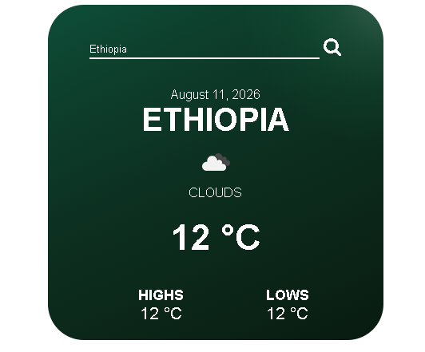

# Weather App

A clean, responsive weather application built with React and Vite. Search for any city and get real-time weather information with a modern, minimal interface.

## Features

- **Real-time Weather Data** - Get current temperature, weather conditions, and more using OpenWeather API
- **City Search** - Easily search for weather in any city worldwide
- **Responsive Design** - Works seamlessly on desktop, tablet, and mobile devices
- **Clean UI** - Modern dark theme with smooth gradients and intuitive layout
- **Temperature Display** - View current temperature with weather icons
- **Additional Info** - Check humidity, wind speed, and other weather metrics
- **Error Handling** - Clear feedback if city is not found

## Screenshots

Add your preview image here:



## Tech Stack

- **React 19** - UI framework
- **Vite** - Lightning-fast build tool
- **Axios** - HTTP client for API requests
- **OpenWeatherMap API** - Weather data provider
- **Lucide React** - Icon library
- **CSS** - Responsive styling with media queries

## Installation

1. Clone the repository:

```bash
git clone <repository-url>
cd Weather
```

2. Install dependencies:

```bash
npm install
```

3. Create a `.env` file in the project root with your API key:

```
VITE_WEATHER_API_KEY=your_api_key_here
```

Get your free API key from [OpenWeatherMap](https://openweathermap.org/api)

4. Start the development server:

```bash
npm run dev
```

The app will be available at `http://localhost:5173`

## Usage

1. Open the app in your browser
2. Type a city name in the search bar
3. Press Enter or click the search button
4. View the current weather for that city

## Project Structure

```
src/
├── components/
│   ├── SearchBar.jsx      # City search input
│   ├── WeatherInfo.jsx    # Main weather display
│   ├── Temprature.jsx     # Temperature section
│   └── ExtraInfo.jsx      # Humidity, wind, etc.
├── services/
│   └── weatherApi.js      # API calls
├── App.jsx                # Main app component
├── App.css                # Responsive styles
└── main.jsx               # Entry point
```

## Responsive Breakpoints

- **Desktop (1024px+)** - Full layout with 420px card
- **Tablet (768px - 1023px)** - 90% width with adjusted spacing
- **Mobile (480px - 767px)** - 95% width with optimized touch targets

## Configuration

### Environment Variables

Create a `.env` file in the root directory:

```
VITE_WEATHER_API_KEY=your_openweathermap_api_key
```

**Important:** The `.env` file must be in the project root (same folder as `package.json`), not in the `src/` folder. After updating the `.env` file, restart your dev server.

## Scripts

```bash
# Start development server
npm run dev

# Build for production
npm run build

# Preview production build
npm run preview

# Run ESLint
npm run lint
```

## Browser Support

- Chrome (latest)
- Firefox (latest)
- Safari (latest)
- Edge (latest)
- Mobile browsers

## Future Enhancements

- Add 5-day forecast
- Geolocation support
- Weather alerts
- Multiple units (Celsius/Fahrenheit)
- City favorites/history
- Dark/light theme toggle

## License

MIT License - Feel free to use this project for personal or commercial purposes.

## Support

If you encounter any issues:

1. Make sure your API key is valid and has quota remaining
2. Restart the dev server after changing `.env`
3. Clear browser cache if styles don't update
4. Check browser console (F12) for error details
